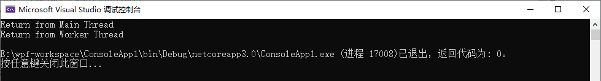
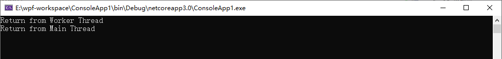
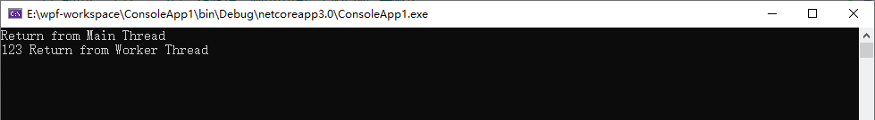

# 专题一：线程基础

>最近一段时间都在研究关于.Net线程的内容，觉得线程是每个程序员都应该掌握的，所以写下这个线程的系列希望能给大家学习过程中一些帮助，同时也是自己对线程的巩固，当中如果有什么错漏还请大家指出，这样我们可以互相得到进步。

## 一、线程的介绍

在介绍线程之前，很有必要知道什么是进程，以及进程和线程的关系。

**进程**(Process)是应用程序的实例要使用的**资源**的一个集合（从可以简化理解：进程就是一种**资源**，是应用程序所用的资源）。每个应用程序都在各自的进程中运行来确保应用程序不受其他应用程序的影响，如果一个应用程序失败了， 只会影响自己的进程，其他进程中的应用程序可以继续运行。进程是操作系统为我们提供的一种保护应用程序的一种机制。

**线程**是进程中基本执行单元， 一个进程中可以包含多个线程，在进程入口执行的第一个线程是一个进程的主线程，在.Net应用程序中，都是以Main()方法作为程序的入口的， 所以在程序运行过程中调用这个方法时，系统就会自动创建一个主线程。（他们之间的关系简单说：线程是进程的执行单元，进程是线程的一个容器了）。

## 二、线程调度和优先级

Windows之所以被称为**抢占式多线程操作系统**，是因为线程可以在任意时间被抢占，并调度另一个线程。每个线程都分配了从0~31的一个优先级。系统首先把高优先级的线程分配给CPU执行。Windows 支持7个相对线程优先级：Idle,Lowest,Below Normal,Normal,Above Normal,Highest和Time-Critical,Normal是默认的线程优先级，然而在程序中可以通过设置Thread的Priority属性来改变线程的优先级，它的类型为ThreadPriority枚举类型，包含枚举有：Lowest,BelowNormal,Normal,AboveNormal和Highest,CLR为自己保留了 Idle和Time-Critical优先级。具体每个枚举值含义如下表：

| 成员名称    | 说明                                                         |
| :---------- | :----------------------------------------------------------- |
| Lowest      | Thread can be scheduled after threads with any other priority." data-guid="3e53547e0e9a509aff4a76382e494083">可以将 Thread何其他优先级的线程之后。 |
| BelowNormal | Thread can be scheduled after threads with Normal priority and before those with Lowest priority." data-guid="f979b4a5dfbb5a35942312092b2cd47a">可以将 Thread Normal 优先级的线程之后，在具有 Lowest 优先级的线程之前。 |
| Normal      | Thread can be scheduled after threads with AboveNormal priority and before those with BelowNormal priority." data-guid="8b94d9644aacd17640f4971fc6e79dc7">可以将 Thread AboveNormal 优先级的线程之后，在具有 BelowNormal 优先级的线程之前。 Normal priority by default." data-guid="6fa67ded483ad3d242ea365f0ac225c4">默认情况下，线程具有 Normal 优先级。 |
| AboveNormal | Thread can be scheduled after threads with Highest priority and before those with Normal priority." data-guid="d067edb8ea0b5bfd51a2591334b86fd7">可以将 Thread Highest 优先级的线程之后，在具有 Normal 优先级的线程之前。 |
| Highest     | Thread can be scheduled before threads with any other priority." data-guid="fc7a0e931c772d08fc98b6de2c82ab3c">可以将 Thread 其他优先级的线程之前。 |

## 三、前台线程和后台线程

在.net中线程分为前台线程和后台线程，在一个进程中，当所有前台线程停止运行时，CLR会强制结束仍在运行的任何后台线程，这些后台线程直接被终止，不会抛出异常。

所以我们应该在前台线程中执行我们确实要完成的事情，另外， 应该把非关键的任务使用后台线程，我们用Thread创建的是线程为前台线程。让我们通过下面的一段代码来看看前台线程和后台线成的区别：

```C#
using System;
using System.Threading;
class Program
    {
        static void Main(string[] args)
        {
            // 创建一个新线程（默认为前台线程）
            Thread backthread = new Thread(Worker);

            // 使线程成为一个后台线程
            backthread.IsBackground = true;

            // 通过Start方法启动线程
            backthread.Start();

            // 如果backthread是前台线程，则应用程序大约5秒后才终止
            // 如果backthread是后台线程，则应用程序立即终止
            Console.WriteLine("Return from Main Thread");
        }
        private static void Worker()
        {
            // 模拟做10秒
            Thread.Sleep(5000);

            // 下面语句，只有由一个前台线程执行时，才会显示出来
            Console.WriteLine("Return from Worker Thread");
        }
}
```

运行上面代码可以发现：控制台中显示字符串: Return form Main Thread 后就退出了， 字符串 Return from Worker Thread字符串根本就没有显示，这是因为此时的backthread线程为后台线程，当主线程（执行Main方法的线程，主线程当然也是前台线程了）结束运行后，CLR会强制终止后台线程的运行，整个进程就被销毁了，并不会等待后台线程运行完后才销毁。如果把 backthread.IsBackground = true; 注释掉后， 就可以看到控制台过5秒后就输出 Return from Worker Thread。再在Worker方法最后加一句 代码：Console.Read(); 就可以看到这样的结果了：



**注意**：有些人可能会问我不想把 backthread.IsBackground = true;注释掉， 又想把Worker()方法中的字符串输出在控制台上怎么做呢？ 其实是有解决的办法的， 我们可以调用thread.Join()方法来实现，Join()方法能保证主线程（前台线程）在异步线程thread（后台线程）运行结束后才会运行。

实现代码如下：

```c#
using System;
using System.Threading;
class Program
    {
        static void Main(string[] args)
        {
			// 创建一个新线程（默认为前台线程）
            Thread backthread = new Thread(Worker);

            // 使线程成为一个后台线程
            backthread.IsBackground = true;

            // 通过Start方法启动线程
            backthread.Start();
            backthread.Join();

            // 模拟主线程的输出
            Thread.Sleep(2000);

            Console.WriteLine("Return from Main Thread");
            Console.Read();
        }

        private static void Worker()
        {
            // 模拟做3秒
            Thread.Sleep(3000);

            // 下面语句，只有由一个前台线程执行时，才会显示出来
            Console.WriteLine("Return from Worker Thread");

        }
}
```

运行结果（调用Join方法后后台线程会阻塞主线程所以主线程会后输出）：



## 四、简单线程的使用

其实在上面介绍前台线程和后台线程的时候已经通过ThreadStart委托创建了一个线程了，此时已经实现了一个多线程的一个过程，为此系列中将多线程也是做一个铺垫吧。下面通过**ParameterizedThreadStart**委托的方式来实现多线程。

以**ParameterizedThreadStart**委托的方式来实现多线程：

```C#
using System;
using System.Threading;
class Program
    {
        static void Main(string[] args)
        {
			// 创建一个新线程（默认为前台线程）
            Thread backthread = new Thread(new ParameterizedThreadStart(Worker));

            // 通过Start方法启动线程
            backthread.Start("123");

            // 如果backthread是前台线程，则应用程序大约5秒后才终止
            // 如果backthread是后台线程，则应用程序立即终止
            Console.WriteLine("Return from Main Thread");
        }

        private static void Worker(object data)
        {
            // 模拟做5秒
            Thread.Sleep(5000);

            // 下面语句，只有由一个前台线程执行时，才会显示出来
            Console.WriteLine(data + " Return from Worker Thread");
            Console.Read();
        }
}
```

注意：此时Worker方法传入了一个参数，并且Start方法也传递了一个字符传参数。 对比与之前创建Thread的不同，运行结果为：

